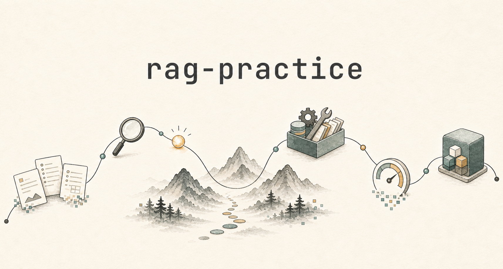

# rag-practice

一套从 **Mini RAG** 到 **Production RAG** 的工程实践练习

&nbsp;

这个仓库不是为了再造一个 RAG 框架，而是把 RAG 从“能跑通的 Demo”一步步推进到“更接近真实业务的生产形态”：先理解最小闭环，再补上混合检索、重排、权限过滤、上下文组装、引用校验、评测、trace / monitoring 和可排障兜底这些绕不开的工程问题。

## 项目定位

`rag-practice` 分成两条主线：

| 项目 | 目标 | 重点 |
| --- | --- | --- |
| [`mini_rag/`](./mini_rag/) | 用最少代码跑通 RAG 闭环 | 文档加载、切分、索引、召回、生成 |
| [`production_rag/`](./production_rag/) | 把 RAG 推向工程化形态 | 混合检索、Rerank、权限过滤、上下文组装、引用溯源、评测、trace / monitoring、可排障兜底 |

## 快速入口

- [Mini RAG 实操手册](./mini_rag/README.md)：先跑通最小 RAG 链路，看清文档、chunk、embedding、召回和生成之间怎么接起来。
- [Production RAG 工程化实操手册](./production_rag/README.md)：再看生产风格链路如何处理权限、混合检索、rerank、context packet、引用校验和监控事件。

## 适合谁

- 已经知道 RAG 是什么，但想真正动手跑一遍的人
- 做过 RAG Demo，但不知道怎么往生产项目推进的人
- 想系统理解检索、Rerank、上下文组装、评测与可观测性的人
- 正在做 LLM 应用，希望少踩一些 RAG 工程坑的人

## 学习路线

1. 先跑通 [`mini_rag/`](./mini_rag/)，理解 RAG 的最小闭环。
2. 再进入 [`production_rag/`](./production_rag/)，看每个工程模块为什么被引入。
3. 对照配套文章，把代码里的设计取舍串起来。
4. 根据自己的业务场景，替换数据、模型、检索策略和评测方式。

## License

本项目使用 [MIT License](./LICENSE)。

## 配套文章

这个项目会和公众号「灵机遣记」里的 RAG 系列文章同步更新。

文章会重点解释代码背后的工程判断：为什么要这样切分，什么时候需要混合检索，Rerank 到底解决什么问题，上下文为什么会失控，以及一个 RAG 系统怎么做评测和观测。

  

  扫码关注公众号：灵机遣记

